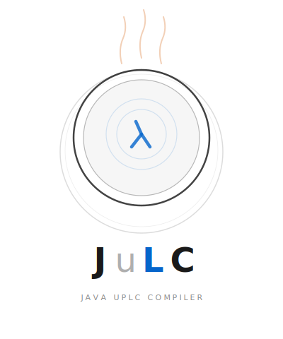

<p align="center">
  
</p>

> **Warning**
> **Experimental / Research Project**
>
> Most of the code in this project is generated using AI, with human-assisted design, testing, and verification.
> This is an experimental project created mainly for research and exploration purposes.
>
> **Please do not use this in production.** Expect rough edges, incomplete features, and potential bugs.

# julc

**Java UPLC Compiler for Cardano**

*Pronounced like "bulk" — not "joolk"*

Write Cardano smart contracts in Java and compile them to Plutus V3 UPLC. julc provides a complete
toolchain: a Java-subset compiler, a pluggable VM for local evaluation, a standard library of on-chain
operations, and first-class integration with [cardano-client-lib](https://github.com/bloxbean/cardano-client-lib).

## Features

- **Java-to-UPLC compiler** — write validators in a familiar Java subset, compile to Plutus V3
- **Typed ledger access** — `ScriptContext`, `TxInfo`, `TxOut`, `Value` with typed field access and chaining
- **Records and sealed interfaces** — data modeling with pattern matching, switch expressions, and exhaustiveness checking
- **Instance methods** — `list.contains()`, `value.lovelaceOf()`, `map.get()`, `optional.isPresent()` and more
- **Lambda expressions and HOFs** — `ListsLib.map()`, `filter()`, `foldl()`, `any()`, `all()`, `find()`, `zip()`
- **Nested loops** — for-each and while loops with nesting, multi-accumulator, and break support
- **Standard library** — 11 libraries: math, lists, maps, values, intervals, crypto, bitwise, output, address, contexts, byte strings
- **@NewType** — zero-cost type aliases for single-field records
- **Tuple2/Tuple3** — generic tuples with auto-unwrapping field access
- **Type.of() factories** — `PubKeyHash.of(bytes)`, `PolicyId.of(bytes)`, etc. for ledger hash types
- **JulcList/JulcMap** — typed collection interfaces with IDE autocomplete for on-chain methods
- **Annotation processor** — `@SpendingValidator`, `@MintingValidator`, `@Entrypoint` for compile-time code generation
- **Pluggable VM** — evaluate UPLC programs locally via SPI (Scalus backend included)
- **Testkit** — test validators locally without a running node
- **Gradle plugin** — compile validators and bundle on-chain sources as part of your build
- **cardano-client-lib integration** — deploy and submit transactions with compiled scripts

## Modules

| Module | Description |
|--------|-------------|
| `julc-core` | UPLC AST, CBOR/FLAT serialization |
| `julc-vm` | VM SPI interface |
| `julc-vm-scalus` | Scalus-based VM backend |
| `julc-ledger-api` | ScriptContext, TxInfo, and ledger types |
| `julc-compiler` | Java source to UPLC compiler |
| `julc-stdlib` | On-chain standard library |
| `julc-onchain-api` | Annotations and builtin stubs for IDE support |
| `julc-testkit` | Testing utilities for validators |
| `julc-cardano-client-lib` | cardano-client-lib integration |
| `julc-gradle-plugin` | Gradle build plugin |
| `julc-annotation-processor` | Compile-time annotation processor |
| `julc-examples` | Example validators |

## Quick Start

### Dependencies

```groovy
dependencies {
    implementation 'com.bloxbean.cardano:julc-onchain-api:0.1.0-SNAPSHOT'
    annotationProcessor 'com.bloxbean.cardano:julc-annotation-processor:0.1.0-SNAPSHOT'

    testImplementation 'com.bloxbean.cardano:julc-testkit:0.1.0-SNAPSHOT'
    testImplementation 'com.bloxbean.cardano:julc-vm:0.1.0-SNAPSHOT'
    testRuntimeOnly 'com.bloxbean.cardano:julc-vm-scalus:0.1.0-SNAPSHOT'
}
```

### Write a Spending Validator

```java
@SpendingValidator
public class VestingValidator {
    record VestingDatum(byte[] beneficiary, BigInteger deadline) {}

    @Entrypoint
    static boolean validate(VestingDatum datum, PlutusData redeemer, ScriptContext ctx) {
        TxInfo txInfo = ctx.txInfo();
        boolean hasSigner = txInfo.signatories().contains(datum.beneficiary());
        boolean pastDeadline = datum.deadline() > 0;
        return hasSigner && pastDeadline;
    }
}
```

### Write a Minting Validator with Sealed Interface Redeemer

```java
@MintingValidator
public class TokenPolicy {
    sealed interface Action permits Mint, Burn {}
    record Mint(BigInteger amount) implements Action {}
    record Burn() implements Action {}

    @Entrypoint
    static boolean validate(Action action, ScriptContext ctx) {
        TxInfo txInfo = ctx.txInfo();
        return switch (action) {
            case Mint m -> m.amount() > 0 && !txInfo.signatories().isEmpty();
            case Burn b -> true;
        };
    }
}
```

### Compile and Evaluate

```java
var stdlib = StdlibRegistry.defaultRegistry();
var compiler = new JulcCompiler(stdlib::lookup);

var result = compiler.compile(javaSource);
if (!result.hasErrors()) {
    Program program = result.program();
    // Ready for serialization and on-chain deployment
}
```

### Test Locally

```java
var vm = JulcVm.create();
var evalResult = vm.evaluateWithArgs(program, datum, redeemer, scriptContext);
assertTrue(evalResult.isSuccess());
```

## Benchmarks

WingRiders-style batched swap benchmark (julc-annotation-test):

| Requests per Tx | Total CPU | Per-Request CPU | Per-Request Mem |
|-----------------|-----------|-----------------|-----------------|
| 1 | 24.6M | 24.6M | 91.4K |
| 2 | 37.6M | 18.8M | 70.7K |
| 4 | 68.8M | 17.2M | 65.7K |
| 10 | 204.3M | 20.4M | 79.6K |
| 24 | 764.3M | 31.8M | 126.3K |
| 30 | 1.1B | 37.0M | 147.1K |

Comparison with other Cardano smart contract languages (per-request CPU):

| Language | Per-Request CPU |
|----------|-----------------|
| Plinth (Haskell) | 723M |
| Aiken (Rust-like) | 164M |
| Plutarch (Haskell eDSL) | 121M |
| **JuLC (Java)** | **~20-37M** |

## Requirements

- **Java 25** (GraalVM recommended)
- **Gradle 9+**

## Documentation

| Guide | Description |
|-------|-------------|
| [Getting Started](docs/getting-started.md) | Comprehensive guide: validators, data modeling, collections, control flow, stdlib, testing, deployment |
| [API Reference](docs/api-reference.md) | All supported types, operators, methods, and ledger access |
| [Standard Library Guide](docs/stdlib-guide.md) | All 11 stdlib libraries with usage examples |
| [Advanced Guide](docs/advanced-guide.md) | Low-level PlutusData patterns, type casting, raw list/map manipulation, debugging |
| [For-Loop Patterns](docs/for-loop-patterns.md) | For-each, while, nested loops, multi-accumulator, break |
| [Library Developer Guide](docs/library-developer-guide.md) | Writing `@OnchainLibrary` modules and PIR API |
| [Performance Guide](docs/performance-guide.md) | Script size/budget optimization and benchmark data |
| [Troubleshooting](docs/troubleshooting.md) | Every compiler error, common mistakes, and FAQ |
| [Compiler Developer Guide](docs/compiler-developer-guide.md) | Internal architecture for compiler contributors |
| [Type Method Comparison](docs/type-method-compilation-comparison.md) | How JuLC compares to Opshin and Scalus |

## License

MIT
