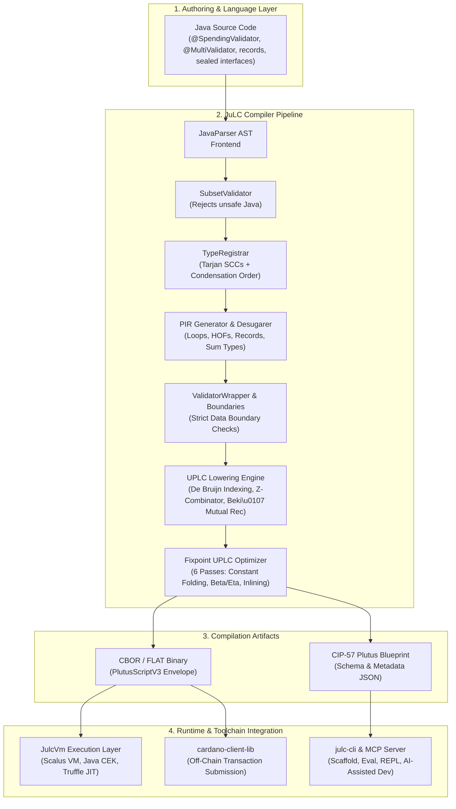
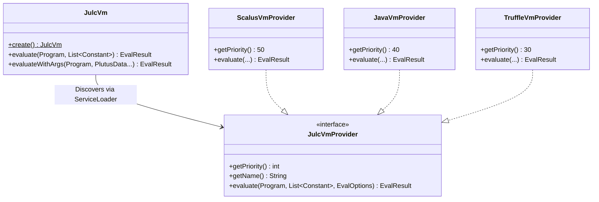
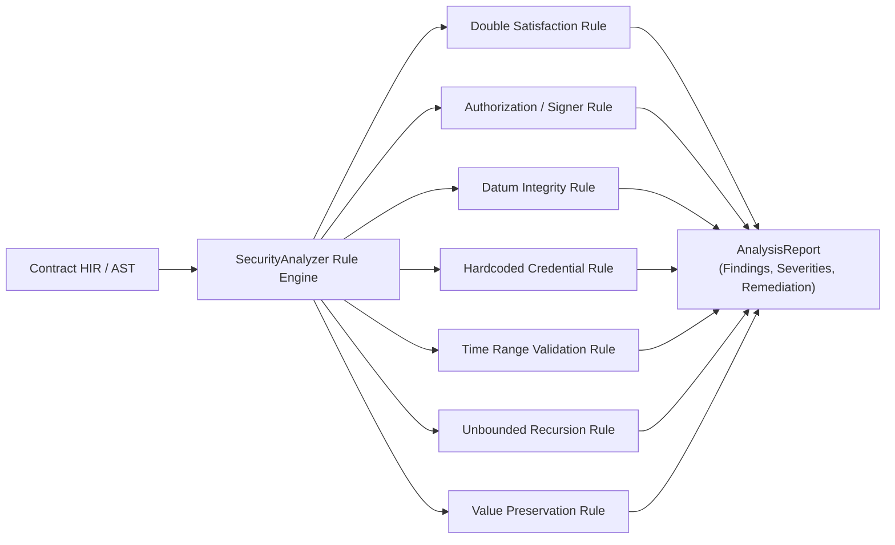
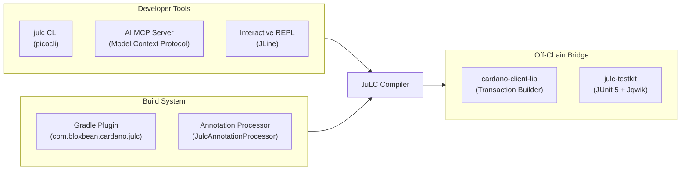

# JuLC: High-Level Design Document (HLD)

**Project:** JuLC (Java UPLC Compiler for Cardano)
**Target Platform:** Cardano Plutus V3 (Conway Era & PV11 Ready)
**Toolchain:** Java 25 / Gradle 9+
**Status:** Living Architectural Design Document

> JuLC is an experimental research project. This document describes intended
> and implemented architecture; it is not a production-safety claim.

---

## 1. Executive Summary & Vision

**JuLC** is an end-to-end compiler toolchain and developer platform that enables writing Cardano smart contracts (validators) in **idiomatic, safe Java** and compiling them into **Plutus V3 Untyped Plutus Lambda Calculus (UPLC)** bytecode.

JuLC brings enterprise Java developers into the Cardano smart contract ecosystem by providing:
- High-level, type-safe Java language constructs (Java records, sealed interfaces, pattern matching, switch expressions, and lambdas).
- Strict compiler guarantees (canonical constructor boundaries, deterministic lowered bytecode, zero-cost abstractions).
- A complete local development and testing environment (pluggable VM, property-based testing, static security analysis, formal verification, CLI with MCP server support, and off-chain SDK integration).



---

## 2. Core Architectural Invariants

As defined in the project governance and compiler architecture, the following invariants govern all design and implementation decisions:

1. **Semantic Preservation:** Supported Java source constructs must compile to UPLC with exact source-language semantics (preserving evaluation order, branching, failure behavior, collection immutability, and equality).
2. **Safe Java Subset:** JuLC deliberately targets a sound, deterministic subset of Java. Unsupported dynamic or non-deterministic features (reflection, raw threads, IO, shared mutable state) are rejected fail-fast at compile time.
3. **Strict Typed Boundaries:** Canonical Plutus `Data` constructors, tags, field ordering, container encodings, and recursive types are strictly validated before entrypoint execution.
4. **Deterministic Lowering:** Compiling identical source code with the same configuration produces identical UPLC bytecode and CBOR representations.
5. **On-Chain Budget Consciousness:** Compilation and optimization prioritize minimizing script size (bytes) and CPU/Memory execution units.

---

## 3. Tiered System Architecture

JuLC is structured into four primary architectural tiers:

```mermaid
graph TD
    classDef tooling fill:#e1f5fe,stroke:#0288d1,stroke-width:2px;
    classDef compiler fill:#ede7f6,stroke:#512da8,stroke-width:2px;
    classDef verification fill:#e8f5e9,stroke:#388e3c,stroke-width:2px;
    classDef ledger fill:#fff3e0,stroke:#f57c00,stroke-width:2px;
    classDef core fill:#fce4ec,stroke:#c2185b,stroke-width:2px;

    subgraph Tier4["Tier 4: Tooling, Ecosystem & Apps"]
        CLI["julc-cli<br/>(Scaffold, REPL, MCP)"]:::tooling
        GRADLE["julc-gradle-plugin<br/>(Build automation)"]:::tooling
        PLAYGROUND["julc-playground<br/>(Web compiler & runner)"]:::tooling
        DECOMPILER["julc-decompiler<br/>(UPLC to Java AST)"]:::tooling
    end

    subgraph Tier3["Tier 3: Compiler & On-Chain Runtime"]
        COMPILER["julc-compiler<br/>(PIR, Lowering, Optimizer)"]:::compiler
        STDLIB["julc-stdlib<br/>(11+ on-chain libraries)"]:::compiler
        ANNOTATION["julc-annotation-processor<br/>(javac compile-time generator)"]:::compiler
    end

    subgraph Tier2["Tier 2: Testing, Verification & Ledger Bridge"]
        TESTKIT["julc-testkit & testkit-jqwik<br/>(Local testing & Property generation)"]:::verification
        ANALYSIS["julc-analysis & analyzer-cli<br/>(Static security analyzer)"]:::verification
        VERIFY["julc-verification<br/>(Property verification DSL)"]:::verification
        LEDGER["julc-ledger-api<br/>(ScriptContext, TxInfo records)"]:::ledger
        BLUEPRINT["julc-blueprint<br/>(CIP-57 Blueprint & Schemas)"]:::ledger
        CCL["julc-cardano-client-lib<br/>(Off-chain integration)"]:::ledger
    end

    subgraph Tier1["Tier 1: Core Foundation & Pluggable VMs"]
        CORE["julc-core<br/>(Term AST, PlutusData, FLAT/CBOR)"]:::core
        BLS["julc-bls<br/>(BLS12-381 Cryptography)"]:::core
        VM["julc-vm<br/>(VM SPI Facade)"]:::core
        VMSCALUS["julc-vm-scalus<br/>(Scalus CEK Provider)"]:::core
        VMJAVA["julc-vm-java<br/>(Pure Java CEK Provider)"]:::core
        VMTRUFFLE["julc-vm-truffle<br/>(Graal Truffle JIT Provider)"]:::core
    end

    CLI --> COMPILER
    CLI --> VM
    GRADLE --> COMPILER
    PLAYGROUND --> COMPILER
    PLAYGROUND --> VM

    COMPILER --> LEDGER
    COMPILER --> STDLIB
    COMPILER --> CORE
    ANNOTATION --> COMPILER

    TESTKIT --> COMPILER
    TESTKIT --> VM
    ANALYSIS --> COMPILER
    VERIFY --> COMPILER
    CCL --> LEDGER
    CCL --> CORE

    VM --> CORE
    VMSCALUS --> VM
    VMJAVA --> VM
    VMTRUFFLE --> VM
    VM --> BLS
```



### Module Responsibilities

| Tier | Module | Purpose |
|---|---|---|
| **Tier 1: Core Foundation** | [`julc-core`](../../julc-core) | Plutus V3 UPLC `Term` AST, `PlutusData`, `DefaultFun` builtins, FLAT/CBOR serializers. |
| | [`julc-vm`](../../julc-vm) | SPI interface for Plutus VM execution, protocol feature profiles, and evaluation budgets. |
| | [`julc-vm-scalus`](../../julc-vm-scalus) | Scalus-backed CEK VM provider (Scala 3). |
| | [`julc-vm-java`](../../julc-vm-java) | Pure Java CEK VM implementation without Scala dependencies. |
| | [`julc-vm-truffle`](../../julc-vm-truffle) | High-performance GraalVM Truffle JIT VM for UPLC. |
| | [`julc-bls`](../../julc-bls) | Native bindings and operations for BLS12-381 pairing cryptography. |
| **Tier 2: Ledger & Verification** | [`julc-ledger-api`](../../julc-ledger-api) | Typed ledger data structures (`ScriptContext`, `TxInfo`, `TxOut`, `Value`, `Address`). |
| | [`julc-blueprint`](../../julc-blueprint) | CIP-57 Blueprint generation and schema validation. |
| | [`julc-analysis`](../../julc-analysis) | Static security rule checker (detects double satisfaction, datum integrity flaws, etc.). |
| | [`julc-verification`](../../julc-verification) | Formal property verification DSL (signer checks, controlled mints, state transitions). |
| | [`julc-testkit`](../../julc-testkit) | Local validator unit test harness and execution budget assertions. |
| | [`julc-testkit-jqwik`](../../julc-testkit-jqwik) | Jqwik property-based test generators for Cardano ledger types. |
| | [`julc-cardano-client-lib`](../../julc-cardano-client-lib) | Bridge for deploying and interacting with compiled scripts via `cardano-client-lib`. |
| **Tier 3: Compiler & Runtime** | [`julc-compiler`](../../julc-compiler) | Complete Java-to-UPLC compiler pipeline (subset validation, PIR, lowering, optimization). |
| | [`julc-stdlib`](../../julc-stdlib) | Standard library of 11+ modules (`ListsLib`, `ValuesLib`, `ContextsLib`, etc.). |
| | [`julc-annotation-processor`](../../julc-annotation-processor) | `javac` annotation processor compiling validator classes during normal Java builds. |
| **Tier 4: Tooling & Apps** | [`julc-cli`](../../julc-cli) | Command-line tool for project scaffolding, compilation, evaluation, REPL, and MCP server. |
| | [`julc-gradle-plugin`](../../julc-gradle-plugin) | Gradle plugin managing contract compilation and `@OnchainLibrary` source bundling. |
| | [`julc-decompiler`](../../julc-decompiler) | Decompiles raw UPLC bytecode back to high-level structured Java representation. |
| | [`julc-playground`](../../julc-playground) | Interactive web-based IDE and execution playground. |

---

## 4. End-to-End Compiler Pipeline

The compilation process is managed by [`JulcCompiler`](../../julc-compiler/src/main/java/com/bloxbean/cardano/julc/compiler/JulcCompiler.java) across 5 distinct phases:

```mermaid
sequenceDiagram
    autonumber
    participant Dev as Java Validator Source
    participant Parse as Phase 1: Parse & Validate
    participant Reg as Phase 2: Type Registration
    participant PIR as Phase 3: PIR Generation
    participant UPLC as Phase 4: UPLC Lowering & Recursion
    participant Opt as Phase 5: Optimization & Packaging

    Dev->>Parse: Supply .java files
    Parse->>Parse: JavaParser AST Generation
    Parse->>Parse: SubsetValidator (Check syntax & restricted Java)

    Parse->>Reg: Pass verified AST
    Reg->>Reg: Detect Records, Sealed Interfaces, @NewType
    Reg->>Reg: Tarjan SCCs and deterministic condensation ordering
    Reg->>Reg: Auto-register .of() factories & Symbol Tables

    Reg->>PIR: Registered Types & AST
    PIR->>PIR: Desugar Loops (while/for-each to tail recursion)
    PIR->>PIR: Lower HOFs (map, filter, foldl) & Lambdas
    PIR->>PIR: Pattern matching & Switch expression lowering
    PIR->>PIR: Emit PIR (Plutus Intermediate Representation)

    PIR->>UPLC: Pass PIR Term Tree
    UPLC->>UPLC: ValidatorWrapper (ScriptPurpose wrapping & context decode)
    UPLC->>UPLC: StrictBoundaryGenerator (Validate incoming Data)
    UPLC->>UPLC: De Bruijn Index Resolution (Scope Stack)
    UPLC->>UPLC: Z-Combinator (Self-recursion) / Beki\u0107 Theorem (Mutual recursion)

    UPLC->>Opt: Lowered UPLC AST
    Opt->>Opt: Fixpoint Optimizer (6 passes up to 20 rounds)
    Opt->>Opt: FLAT Serialization & CBOR Encoding
    Opt->>Opt: CIP-57 Blueprint Generation
    Opt-->>Dev: CompileResult (Program, Blueprint, Size, Diagnostics)
```

### Compiler Optimization Passes

The [`UplcOptimizer`](../../julc-compiler/src/main/java/com/bloxbean/cardano/julc/compiler/uplc/UplcOptimizer.java) executes iteratively until fixpoint (or a maximum of 20 iterations):

1. **Force-Delay Cancellation:** Simplifies `Force(Delay(t))` $\to$ `t`.
2. **Constant Folding:** Evaluates pure arithmetic, relational, and logical builtins on known constants at compile time.
3. **Dead Code Elimination:** Removes unreferenced `Apply(Lam(x, body), pureVal)` bindings.
4. **Beta Reduction ($\beta$-reduction):** Inlines single-use pure lambda arguments directly into function bodies.
5. **Eta Reduction ($\eta$-reduction):** Simplifies `Lam(x, Apply(f, Var(1)))` $\to$ `f` when $x$ is not free in $f$.
6. **Constr-Case Reduction:** Resolves `Case(Constr(tag, fields), branches)` directly to `branches[tag](fields)` at compile time.

---

## 5. Subsystem Details

### 5.1 Pluggable VM SPI Architecture (`julc-vm`)

JuLC decouples the compiler from execution engines using a standard Java SPI (`JulcVmProvider`).



- **Highest Priority Wins:** `JulcVm.create()` automatically selects the highest-priority provider present on the classpath.
- **Cost Models & Limits:** Supports protocol version profiles (`PV10`, `PV11`) with exact execution unit budgeting (CPU & Memory steps).

### 5.2 Static Security Analysis Engine (`julc-analysis`)

Smart contracts can be inspected by the security analyzer for common Cardano design flaws:



### 5.3 Formal Property Verification DSL (`julc-verification`)

JuLC allows developers to state named formal security properties as typed annotations or DSL rules. The verification workflow checks those properties for an exact compiled artifact under recorded assumptions and bounds; it does not prove that the whole contract is safe:
- **`RequiresSignerProperty`**: Formally asserts that state modifications or funds release require valid cryptographic signatures from designated parties.
- **`ControlledMintProperty`**: Verifies that token minting policies cannot be executed without meeting specific precondition predicates.
- **`StatefulSpendingProperty`**: Validates correct state transitions across UTxO datum lifecycles.

---

## 6. Developer Experience & Integration Points



- **AI-Assisted Workflow:** The CLI includes a native Model Context Protocol (MCP) server (`julc mcp`), allowing AI coding assistants to compile, validate, explain, and evaluate validators in real time.
- **Dual Packaging Artifacts:**
  - `META-INF/plutus/*.plutus.json`: Compiled UPLC scripts and CIP-57 blueprints for on-chain execution.
  - `META-INF/plutus-sources/*`: Original `@OnchainLibrary` Java sources bundled into JARs for seamless cross-module compilation.

---

## 7. Summary & Roadmap

JuLC establishes a robust, highly modular compiler infrastructure for Cardano smart contract development in Java. By combining high-level Java safety, strict type boundaries, pluggable VM backends, and formal verification tools, JuLC brings enterprise developer tooling to Plutus V3 on-chain programming.
